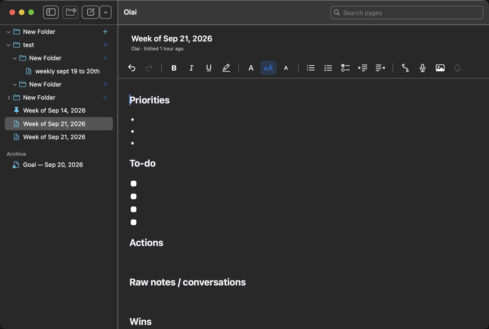
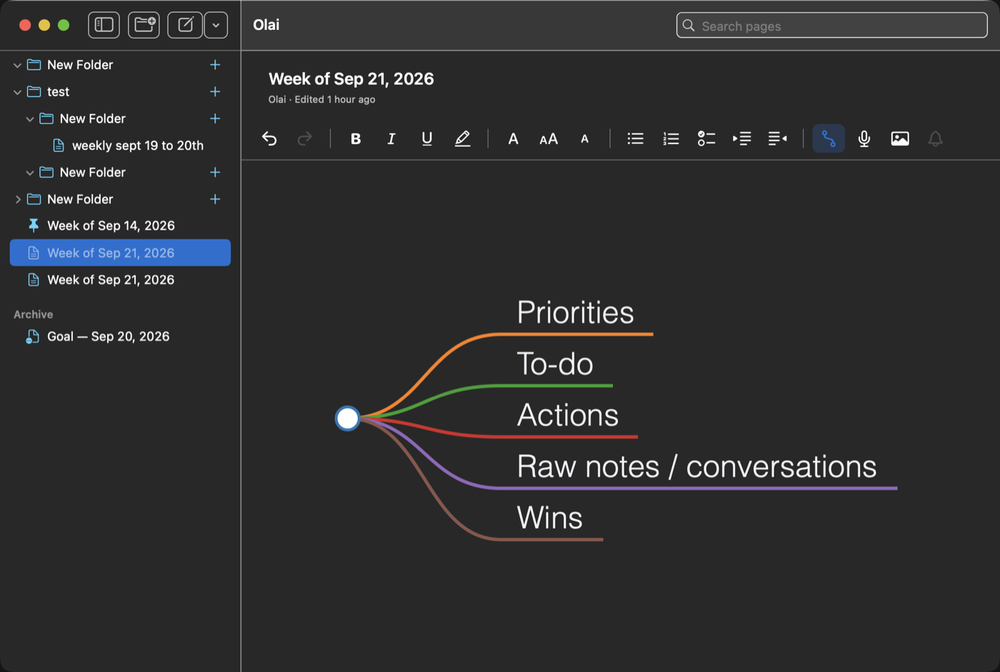

<div align="center">


# Olai

**ஓலை** — *palm leaf.* A personal notes app for macOS and iPhone, with an agent that
reads your notes back to you.

Rich text in folders, synced over iCloud, exported as Markdown, and queryable from
Claude Code for weekly summaries and next-week priorities.

</div>

---



Write in a block editor with headings, lists, checkboxes and images. Type `-` for a
bullet, `[]` for a checkbox. Schedule any task and it becomes a reminder that notifies
you. Dictate with the microphone, on-device.



Any page collapses to a mind map of its own outline — headings and the bullets under
them — in the same view, one click away.

## What it is

A single-user notes app that does three things most don't:

- **Your notes stay files.** Every page is exported as Markdown with YAML frontmatter,
  in a folder you choose. Nothing is locked in a database you cannot read.
- **An agent can read them.** An MCP server over that folder gives Claude your weekly
  pages, your goals and their evidence — so "what should I prioritise next week?" is
  answered from what you actually wrote.
- **It syncs without a backend.** SwiftData over the CloudKit private database. No
  server, no account beyond the iCloud one you already have.

## How it is put together

```
 iPhone ─┐
         ├─ SwiftData ──► CloudKit private database
  Mac ───┘      │
                ├──► TipTap editor in a WKWebView   (the document)
                ├──► EventKit                       (scheduled tasks)
                └──► Markdown mirror ──► MCP server ──► Claude Code
                     ~/Olai/**.md        read-only
```

Swift owns storage, sync, navigation, templates and export. The document itself is
TipTap running in a `WKWebView`, so the block model is the same on both platforms. The
mirror is written on every change and never read back.

## The mirror

Each page becomes a file, named for its title and id, under its folder path:

```markdown
---
id: AAEA03AB-AC76-4E0E-ADA8-4413E7F810E1
title: "Week of Sep 21, 2026"
template: "weekly"
folder: "Work/Planning"
created: 2026-09-20T20:07:07Z
updated: 2026-09-21T09:14:37Z
period_start: 2026-09-21T07:00:00Z
goals: ["BBBBBBB1-0000-0000-0000-000000000003"]
archived: false
pinned: true
---

## Priorities

- Ship the Markdown mirror

## To-do

- [x] Write the converter
- [ ] Write the server
```

Archived pages move under `_archive/`, images are written beside their page in
`attachments/`, and files the mirror never wrote are left alone.

## Asking your notes a question

```bash
claude mcp add olai --scope user \
  --env OLAI_ROOT="$HOME/Olai" \
  --env PYTHONPATH="$HOME/olai/mcp-server" \
  -- python3 -m olai_mcp.standalone
```

Then, in any Claude Code session:

```
> summarise my last two weeks
> what should I prioritise next week?
> draft a performance review for this quarter
```

Six tools — `search_notes`, `get_page`, `list_pages`, `get_weekly_pages`,
`get_goals_with_evidence` — and three prompts. The server is read-only, opens no
sockets, and runs on the `python3` macOS ships: no packages to install.

For another machine, `mcp-server/build-bundle.sh` produces a single 24 KB file that
needs neither this repository nor GitHub nor `git`. See
[docs/work-laptop.md](docs/work-laptop.md), including how to verify the no-network claim
yourself.

## Templates

Six ship with it. A weekly page is titled for the Monday of the week it covers, with
`period_start` set to match — and a page started on a Sunday is for the week ahead.

| Template | For |
| --- | --- |
| Weekly page | Priorities, to-dos, actions, raw notes, wins |
| Goal | A goal, its success criteria, and running evidence |
| Interview | Who, context, questions, verbatims, insights, follow-ups |
| AI prompt | Prompt, output, notes, tags |
| Transcript | Imported from `.vtt`, `.srt` or `.txt`, with speakers and timings |
| Project | A folder of overview, decisions, meeting notes, open questions |

## Building it

Xcode 16+, and [xcodegen](https://github.com/yonaskolb/XcodeGen). The project file is
generated; `project.yml` is the source of truth.

```bash
xcodegen generate
xcodebuild -scheme Olai -destination 'platform=macOS' build
xcodebuild -scheme Olai -destination 'platform=iOS Simulator,name=iPhone 17 Pro' build
```

To run it on a second Mac without an Apple ID, there is a local build that drops iCloud
and signs itself — see [docs/install-second-mac.md](docs/install-second-mac.md). To hand
it to other people, `scripts/release-mac.sh` signs, notarises and packages a `.dmg`
without going near the App Store — see [docs/distributing.md](docs/distributing.md).

The web editor is built separately and its output is committed, so the app builds
without Node:

```bash
cd Editor && npm install && npm run build   # writes Olai/Resources/editor.html
```

Tests:

```bash
cd OlaiCore && swift test                      # 66 tests
cd mcp-server && python3 -m pytest tests -q    # 17 tests
```

## Status

Working: the editor, images and paste, templates, archive, search and pin, the Markdown
mirror, the MCP server, scheduled tasks, dictation, transcript import, and the mind map.

Not done: the slash commands (`/event`, `/date`, `/template`) are not wired, `/event`
does not create calendar events, there is no UI yet for linking a page to a goal, and
CloudKit sync has not been exercised across two physical devices.

The full specification is [docs/olai-spec.md](docs/olai-spec.md).
